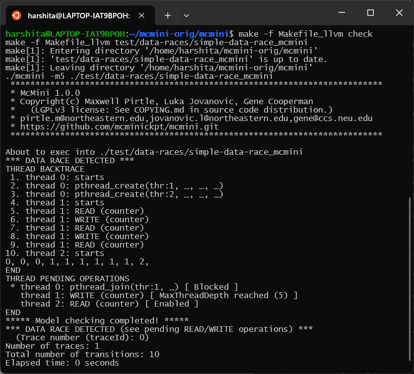

===============
Advanced McMini
===============

.. toctree::
   :hidden:
   :maxdepth: 2

   mcmini-advanced

**TODO:** Advanced features of McMini

.. contents:: Contents of this page
   :backlinks: entry
   :local:
   :depth: 2

------------------------------------------------
Analyzing a trace: ``mcmini --trace <traceSeq>``
------------------------------------------------

**TODO:** Explain that ``traceSeq`` is '0 0 0 1 2', as opposed to ``traceId`` (e.g., 13).

Note that when the traceSeq is completed, McMini continues
to execute new transitions.  It will print:

.. code::

   ... continuing beyond trace sequence:  At transition # <num>

This information can be used later, using mcmini-gdb, to do:

.. code::

   (gdb) mcmini forward <num>
   (gdb) mcmini printPendingTransitions

to examine the pending transitions for each thread.
In this way, we can append a thread number to our ``traceSeq``,
and repeat `-t <traceSeq>`, in order to "steer" McMini
into the path of interest.

--------------------
Exploring data races
--------------------

McMini offers a simple LLVM pass plugin which can be used to instrument any
and all accesses to shared memory, enabling McMini to automatically detect
data races within the instrumented code.

The first, and natural step would be to install the required LLVM packages.

On most Linux distros, LLVM can be installed by adding the following packages:
  **llvm llvm-dev clang**
On Red Hat-based distros, use **llvm-devel**

Now that we have all the required packages, we would need to build the plugin
into a shared library. To do this, within the McMini root directory, run:

.. code::

   make -f Makefile_llvm

The next step would be to instrument our target program.

.. code::

   make -f Makefile_llvm path/to/target-source_mcmini

Now that we have the instrumented code with us, we can simply run it under
McMini as follows:

.. code::

   ./mcmini -m <num> path/to/target-source_mcmini

**NOTE:** The instrumented executable will be compiled with a suffix _mcmini,
and it can only be run under McMini, since calls to functions from the McMini
shared library have been inserted into the original code.

To run a "quick test" and verify the plugin, run:

.. code::

   make -f Makefile_llvm check

This would instrument the file mcmini/test/data-races/simple-data-race.c and
test it under McMini.

You should see the following output:

We can see that McMini successfully detects a data race. To understand
the output, let us have a look at the **THREAD PENDING OPERATIONS**

.. code::

   THREAD PENDING OPERATIONS
    * thread 0: pthread_join(thr:1, _) [ Blocked ]
      thread 1: WRITE (counter) [ MaxThreadDepth reached (5) ]
      thread 2: READ (counter) [ Enabled ]

The output shows that both threads 1 and 2 are trying to access the shared
variable **counter**, thus indicating a data race.

-----------------------------------------
Annotate for improved "THREAD BACKTRACE"
-----------------------------------------

  :command:`python3 mcmini-annotate -t <traceSeq>`

-------------------------------------
Using GDB with ``--trace <traceSeq>``
-------------------------------------

**TODO:**

Start with::
  :command:`mcmini-gdb  -t <traceSeq>`

Then consider::
  :command:`mcmini help`

You will see the following commands, all using a :command:`mcmini` prefix:

> mcmini: forward back printTransactions where help, etc.

For example,

.. code::

   (gdb) mcmini help
   (gdb) mcmini <TAB>
   (gdb) mcmini forward 9
   (gdb) mcmini where
   (gdb) layout src

Recall also that in GDB, 'ctrl-Xa' toggles between full-screen display
and traditional command mode. Further, in full-screen mode, 'ctrl-Xo'
toggles between the focus on the source (cursor keys browse the source
code) and the focus on the GDB command window (editing and re-executing
previous GDB commands).  The GDB commands "focus src" and "focus cmd"
also exist to change the focus for the full-screen mode.

**TODO:** McMini could ask GDB to watch any variable.
In this case, for each call frame, determine if the variable is present
(or else in global scope), and if so, then issue the ``watch`` command.
(**NOTE:** *McMini is open-source, and we welcome additional
developers.*)

-----------------------------------------------------
Extensibility:  Defining new operations, new policies
-----------------------------------------------------

**FILL IN**

(**NOTE:** *McMini is open-source, and we welcome additional
writers of documentation.  A good starting point for the McMini manual
is the McMini paper, cited in the* :ref:`citations` *section.*)

-----------------------------------------------------
FUTURE:  Livelock
-----------------------------------------------------

The McMini architecture is also sufficient to add a *heuristic* for
detecting livelock.  **We have a roadmap for a small addition that
integrates This capability into McMini, and we hope to have this feature
in the future.**
(**NOTE:** *McMini is open-source, and we welcome additional
writers of documentation.  We can guide you in this modest
enhancement of McMini.*)
