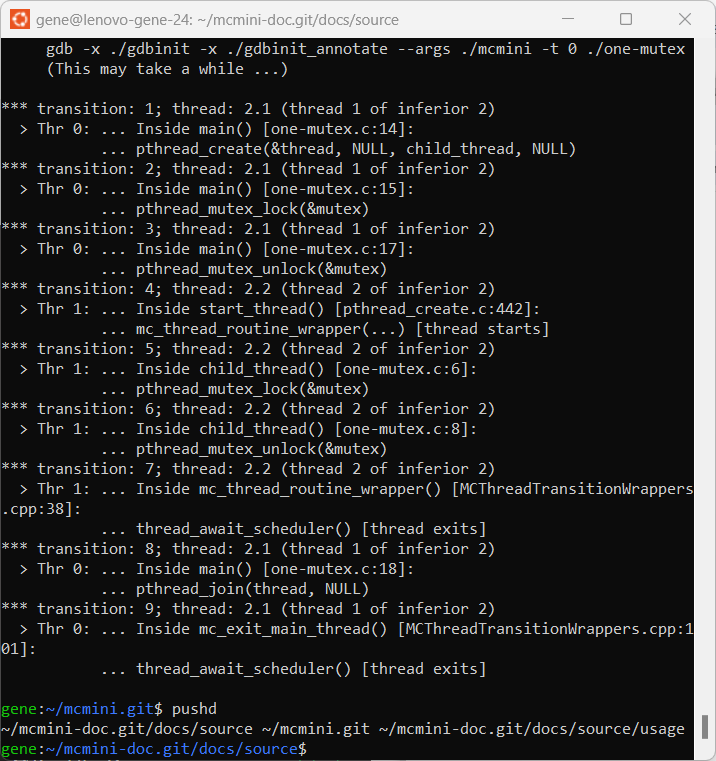

.. _tutorial-basic:

=========================
Tutorial:  Running McMini
=========================

.. toctree::
   :hidden:
   :maxdepth: 2

   tutorial-basic

.. contents:: Contents of this page
   :backlinks: entry
   :local:
   :depth: 2

-----------------------------------
Exploring McMini's search algorithm
-----------------------------------

Given that McMini tries to do aggressive pruning of branches, in order to
reduce the search, it may be intellectually interesting to explore where
McMini does pruning.  For this exercise, we will use the :option:`-v` flag.
We'll again visit a trivial mutex program.  Copy the following program
into a file, :file:`one-mutex.c`, and compile it.  (Don't forget
the ``-pthread`` flag when compiling.)

.. code:: C

   #include <stdio.h>
   #include <pthread.h>
   pthread_mutex_t mutex = PTHREAD_MUTEX_INITIALIZER;

   void *child_thread(void *dummy) {
     pthread_mutex_lock(&mutex);
     printf("child: I locked the mutex!\n");
     pthread_mutex_unlock(&mutex);
     return NULL;
   }

   int main() {
     pthread_t thread;
     pthread_create(&thread, NULL, child_thread, NULL);
     pthread_mutex_lock(&mutex);
     printf("parent: I locked the mutex!\n");
     pthread_mutex_unlock(&mutex);
     pthread_join(thread, NULL);
     printf("*** Done.\n");
     return 0;
   }

.. CO<<EMT:
   WE should define such aliases in a prolog.inc and reference it in you Sphinx configuration file.

.. COMMENT:  Apparently html builder needs |br| to be repeated,
   but text builder inherits from index.rst?

.. |nbsp| unicode:: 0xA0
   :trim:

.. |br| raw:: html

    

.. COMMENT:
   Could consider doctext for shell:  https://github.com/tillahoffmann/sphinxcontrib-shtest
   This also provides a simple example of a Sphinx extension, along with .readthedocs.yaml .

When we run it (:code:`./mcmini ./one-mutex`), McMini reports two
traces.  This shows that McMini searches two branches, based on whether
the parent or the child locks the mutex first.  We can see this explicitly
by running |br|
|nbsp| |nbsp| :code:`./mcmini -v ./one-mutex` (to see the two trace sequences). |br|
For a detailed analysis, one can run |br|
:code:`./mcmini -p 0 -v  ./one-mutex` |br|
or: |br|
|nbsp| |nbsp| :code:`./mcmini -p 1 -v ./one-mutex`.  |br|
(And we could run "`./mcmini -v -v ./one-mutex`" to see both traces in the same command.)

For an example output, we show here only the first case: |br|
|nbsp| |nbsp| :code:`./mcmini -p 0 -v  ./one-mutex`

.. code:: shell

   About to exec into ./one-mutex
   parent: I locked the mutex!
   child: I locked the mutex!
   *** Done.
   TraceId 0:  0, 0, 0, 0, 1, 1, 1, 1, 0,
   Trace process with traceId `0` exited with status 0
   *** -p or --print-at-trace requested.  Printing trace:
   THREAD BACKTRACE
    0. thread 0: starts
    1. thread 0: pthread_create(thr:1, _, _, _)
    2. thread 0: pthread_mutex_lock(mut:1)
    3. thread 0: pthread_mutex_unlock(mut:1)
    4. thread 1: starts
    5. thread 1: pthread_mutex_lock(mut:1)
    6. thread 1: pthread_mutex_unlock(mut:1)
    7. thread 1: exits
    8. thread 0: pthread_join(thr:1, _)
   0, 0, 0, 0, 1, 1, 1, 1, 0,
   END
   THREAD PENDING OPERATIONS
    * thread 0: exits [ Done ]
      thread 1: exits [ Done ]
   END
   ***** Model checking completed! *****
   Number of traces: 1

And while it is overkill here, we may prefer a more detailed overview
with line numbers from the original source code.
We can either pass on the desired trace sequence:

> :code:`./mcmini-annotate -p '0, 0, 0, 0, 1, 1, 1, 1, 0,' ./one-mutex`

or more simply, pass on the original flags:

> :code:`./mcmini-annotate -p 0 ./one-mutex`

They both yield:

Finally, let's look at all the traces (two traces, in this case).

> :code:`./mcmini -q -v ./one-mutex`

.. code::

   TraceId   0:  0, 0, 0, 0, 1, 1, 1, 1, 0,
   Trace process with traceId `0` exited with status 0
   TraceId   1:  0, 0, 1, 1, 1, 0, 0, 1, 0,
   Trace process with traceId `1` exited with status 0
   ***** Model checking completed! *****
   Number of traces: 2

There are only two traces because McMini was able to
determine that :code:`pthread_mutex_unlock()` was independent of
all other thread operations.  Only the owner of a mutex can call
:code:`pthread_mutex_unlock()` on that mutex.  So, the two traces
represent whether Thread |nbsp| 0 or Thread |nbsp| 1 locks the
mutex first.

.. COMMENT:
   **FIXME bugs:**  When the next transition of a trace sequence is not
   enabled, provide an error message.

------------------------------------------
Exploring mcmini-gdb: integration with GDB
------------------------------------------

Once we McMini has reported a deadlock, we have two tools to explore and analyze that deadlock.

 * :program:`mcmini-annotate` - annotating the thread sequence with further details
 * :program:`mcmini-gdb` - running GDB and stepping forward and back through the transitions

Let us begin with GDB, using :program:`mcmini-gdb`.  We will used the
:code:`deadlock.c` program from the :ref:`quick start` subsection.
Be sure to compile 'deadlock.c' with '-g3', for debugging:

> gcc -g3 deadlock.c -o ./deadlock  # Copied from the :ref:`quick start` subsection

And last time (in "Quick Start"), we ran this as:
:code:`./mcmini -f -q -m15 ./deadlock` |br|
So, let's use the same flags, but with :code:`./mcmini-gdb`

> :code:`./mcmini-gdb -f -q -m15 ./deadlock`

.. code::

   ** Generating trace sequence for:
        ./mcmini.git/mcmini -v -q  '-f' '-q' '-m15' './deadlock'
        (This may take a while ...)
   ** Running: /home/gene/mcmini.git/mcmini-gdb -m15 -p 0 -p'0, 0, 0, 1, 1, ' ./deadlock
   ** Note:  In order to replay this trace,
             it is faster to directly run the above command line.
   ...
   About to exec into ./deadlock
   ...
   Thread 2.1 "deadlock" hit Breakpoint 1, main () at deadlock.c:15
   15      int main() {
   ...

   List of commands:

   mcmini -- mcmini <TAB> : show all mcmini commands
   mcmini back -- Go back <count> transitions, by re-executing; default count=1
   mcmini developerMode -- Permanently switch GDB to developer environment.  For developers only.
   mcmini forward -- Execute until next transition; Accepts optional arg: <count>; or: end
   mcmini help -- Prints help for getting started in McMini
   mcmini printPendingTransitions -- Prints the next (pending) transition for each thread
   mcmini printTransitions -- Prints the transitions currently on the stack
   mcmini where -- Execute where, while hiding McMini internal call frames

   Type "help" followed by command name for full documentation.
   Type "apropos word" to search for commands related to "word".
   Type "apropos -v word" for full documentation of commands related to "word".
   Command name abbreviations are allowed if unambiguous.

   *** Type 'mcmini help' for usage. ***
   (Do 'set print address off' for less verbose output.)
   (gdb)

So, let's explore further.  Note the comment at :code:`Running`,
saying that McMini has substituted the following command line.

> :code:`./mcmini-gdb -m15 -p 0 -p'0, 0, 0, 1, 1, ' ./deadlock`

Apparently, when we used the :option:`-f` flag, McMini discovered a trace sequence with just five transitions until deadlock.  And the initial McMini output shows that we can run `mcmini forward 5`, so as to reach this deadlock.  But `mcmini forward end` is easier to type.  So, we'll use that form.  Let's do it.

.. code:: shell

   ./mcmini-gdb -m15 -p 0 -p'0, 0, 0, 1, 1, ' ./deadlock`
   (gdb) mcmini forward end

.. sidebar:: Interpreting 'mcmini forward'

   McMini blocks a thread *before* executing the transition.  Hence,
   it uses the same convention as GDB.  GDB reports the *next* source
   line for the current thread, and McMini reports the *next*
   transition to be executed by the *current* thread.

Now, we can see that under "THREAD PENDING OPERATIONS", both of the
threads are "[ |nbsp| Blocked |nbsp| ]".  And the reason is clear.
Each of the two mutexes have already been locked, and yet each thread
tries to lock the mutex already "owned" by the other thread.

In general, McMini provides a rich set of new GDB commands with prefix
:code:`mcmini`.  And, as usual, GDB provides "tab completion".  So, we
can type :code:`mc<TAB> f<TAB> 5` instead of :code:`mcmini forward 5`.

Each :code:`mcmini` command jumps forward or backward to the desired
transitions (thread operations).  Low-level GDB call frames are hidden,
and only the user's call frames are shown.  For example, ":code:`where`"
would show all call frames, while ":code:`mcmini where`" shows only the
user's call frames.

Now, let's back up one step to see how this deadlock
arose.  Further, this time, let's use the substituted command with the
explicit trace sequence, since McMini says that this will execute faster.
We now have:

.. code::

   ./mcmini-gdb -m15 -p 0 -p'0, 0, 0, 1, 1, ' ./deadlock
   (gdb) mcmini forward end
   (gdb) mcmini back 1
   (gdb) mcmini where
   (gdb) mcmini printTransitions

It's now clear what happened.  Thread 0 has locked mutex |nbsp| 1.
Both threads are "[ |nbsp| Enabled |nbsp| ]" and trying to lock
mutex |nbsp| 2.  If Thread |nbsp| 0 locks mutex |nbsp| 2, then everything
will be fine.  But if Thread |nbsp| 1 locks mutex |nbsp| 2, then
we will have the deadlock that we previously saw.

.. sidebar:: Inside McMini: 'mcmini back'

   In :code:`mcmini forward <count>` the next <count> transitions are
   executed.  The :code:`mcmini back` command kills the current subprocess
   running the target program, starts a new one, and re-executes.
   Hence 'forward |nbsp| 5' followed by 'back |nbsp| 2' results in
   'forward |nbsp| 3'.  If the previous threads were 2.1 and 2.2, GDB will
   show the new threads to be 3.1 and 3.2 for the new process
   (for ":code:`Inferior 3`").

The stack shown by :code:`mcmini where`
is for Thread |nbsp| 1.  This is the case both because
Thread |nbsp| 1 was last executed, and because the display
shows that transition |nbsp| 4 was executed by
"thread |nbsp| 2" in GDB's numbering scheme.
(It's unfortunate, but GDB chooses a one-based numbering scheme
for thread numbers, and McMini chooses a zero-based numbering
scheme.)
The stack also shows that Thread |nbsp| 1 is now in its start
function (`child_thread()`), at line |nbsp| 7 in
:file:`deadlock.c`.

The asterisk next to Thread |nbsp| 1 under "PENDING
OPERATIONS" indicates that for the
current trace sequence (`0,0,0,1,1`), Thread |nbsp| 1 will
have the next transition if we execute :code:`mcmini forward`.
If we wanted to decide what `thr:1` and `mut:1` refer to
in the source code, we could elucidate by calling
:code:`mcmini-annotate` with the same arguments as for
:code:`mcmini-gdb`.

We have hypothesized that since Threads |nbsp| 0 and |nbsp| 1
are both enabled, the deadlock occurs when Thread |nbsp| 1
decides to lock mutex |nbsp| 1, even though that is the
next goal of Thread |nbsp| 0.
Let's prove our theory.  We'll play a "what-if" game.
Instead of the trace sequence

> -p'0, 0, 0, 1, 1, '

let's try:

> -p'0, 0, 0, 1, 0, '

We omit the `-p0` flag and specify only the trace sequence prefix,
to see all possible traces.  It turns out that there is only
one trace with this prefix.

Incidentally, I prefer to switch back and forth between GDB's
test interface and it's full-screen interface.
So, let's use GDB's ":code:`layout src`" command (also available
as 'ctrl-Xa') to provide a full-screen display.  You can toggle back
and forth from full-screen to classic view by again typing 'ctrl-Xa'.
And you can use ":code:`focus src`" or ":code:`focus cmd`" (also available
through 'ctrl-Xo') to switch the focus on which cursor keys operate,
from the source sub-window to the command sub-window.

Since we're now using full-screen mode, let's employ the shorter
McMini command, :code:`mcmini printPendingTransitions`.

.. code::

   ./mcmini-gdb -m15 -p'0, 0, 0, 1, 0, ' ./deadlock
   (gdb) layout src # or ctrl-Xa (full-screen view)
   (gdb) mcmini forward 5
   (gdb) mcmini printPendingTransitions
   # (If GDB's 'src' window misbehaves, scroll up with the cursor keys.)

Now, in the world of this alternative trace, we can see that
for this prefix, Thread |nbsp| 0 would no no longer be blocked.
So, Thread |nbsp| 0 can simply unlock mutex |nbsp| 2.

Indeed, if we use the standard :code:`mcmini` command, we
see a longer trace of 13 |nbsp| transitions,
in which each thread exits successfully.

.. code:: shell

   % ./mcmini -m15 -p'0, 0, 0, 1, 0' ./deadlock
   ...
   THREAD BACKTRACE
   ...
   0, 0, 0, 1, 0, 0, 0, 1, 1, 1, 1, 1, 0,
   END
   THREAD PENDING OPERATIONS
      thread 0: exits [ Done ]
      thread 1: exits [ Done ]
   END

Curiously, this is not one of the three *canonical* trace
sequences, as seen by:

.. code:: shell

   % ./mcmini -q -v ./deadlock
   ... (omitting some lines of the output) ...
   TraceId 0:  0, 0, 0, 0, 0, 0, 1, 1, 1, 1, 1, 1, 0,
   TraceId 1:  0, 0, 0, 1, 1,
   TraceId 2:  0, 0, 1, 1, 1, 1, 0, 1, 0, 0, 0, 1, 0,
   *** DEADLOCK DETECTED ***
     (Trace number (traceId): 1)

Note that this allows us to see all traces in lexicographic order.
If you prefer to see trace sequence number |nbsp| X, only, then do:

> :code:`mcmini -v -pX ./deadlock`

In fact, our new trace is a variant of TraceId |nbsp| 0, above.
TraceId |nbsp| 0, above, differs from our trace with prefix
`0,0,0,1,0` in that our trace shows a fourth transition executed
by thread |nbsp| 1, and in TraceId |nbsp| 0, this has now been delayed
until transition |nbsp| 7.  But this is the transition in which
thread |nbsp| 1 is created.  So, it doesn't matter whether thread
|nbsp| 1 is created sooner or later.  The *canonical* variant uses
lexicographic ordering to prefer transition |nbsp| 4 being executed by
thread |nbsp| 0 instead of thread |nbsp| 1.

We could then explore mixing the built-in GDB commands with
the extended :code:`mcmini` commands supplied by McMini.
It is perfectly possible to use the usual GDB commands
of `print`, `next`, `step`, `continue`, `finish`, and
so on.
(However, currently McMini numbers the threads starting from zero, and GDB
numbers the threads starting from 1.  This may be fixed in the future.)
But if we were to explore mixing native GDB and McMini commands, then
this would no longer be a "basic tutorial".  So, we will stop here,
and leave you to discover these additional possibilities.

----

**Review of McMini flags** (from the
`McMini man page <../index.html#sec-man>`_):

.. option:: -m <num>, --max-depth-per-thread <num>

.. option:: -f, --first, --first-deadlock

.. option:: -q, --quiet

.. option:: -p <traceId|traceSeq>, --print-at-traceId <traceId|traceSeq>

.. option:: -v, --verbose
