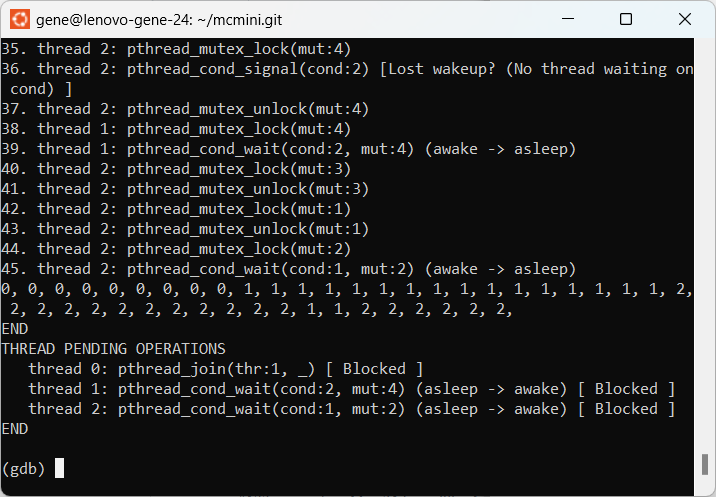
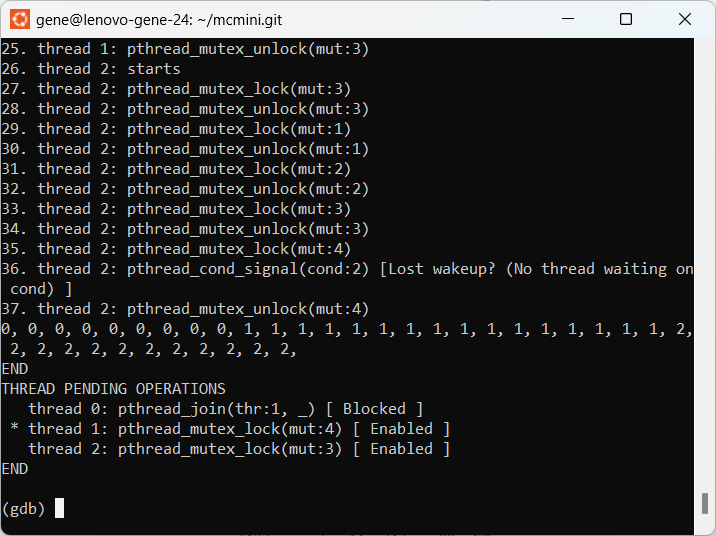

================================
Tutorial: Analyzing a Subtle Bug
================================

.. toctree::
   :hidden:
   :maxdepth: 2
   :reversed:

   tutorial-subtle

.. |nbsp| unicode:: 0xA0
   :trim:

.. |br| raw:: html

    

This tutorial assumes that you have already read the
`man pages <../index.html#sec-man>`_.
It also assumes that you are familiar with condition variables.

.. CO<<EMT:  How do we link to just the man page?

----------------------------------------------
A subtle bug involving two condition variables
----------------------------------------------

This tutorial is based on a buggy program that appeared in stackoverflow:
  https://stackoverflow.com/questions/30554292/c-uninitialized-mutex-works-and-initialized-mutex-fails

Here, we use a slightly modified version of the code that is semantically equivalent, but it makes the
logic clearer, and easier to analyze.

The original program had the goal of solving a producer-consumer problem by using two condition variables,
instead of the traditional two semaphores.
The key to understanding it is to recognize the two structs, ``inEvents`` (for producers that add to
the buffer), and ``outEvents`` (for consumers that remove from the buffer.  When a producer or consumer
has no more tasks to do, it calls ``await()``, which calls ``pthread_cond_Wait``.  When a producer or
consumer wants to signal to its pair, it calls ``advance()``, which calls ``pthread_cond_signal``.

As noted in the stackoverflow page referred to, above, the bug is that
in the ``while`` loop that calls ``pthread_cond_wait``,
the predicate being checked is a local variable private to that thread, instead of a global variable.

Nevertheless, the goal of this tutorial is to show how to use McMini in a
semi-automated fashion to lead us to the bug.  So, we ignore the analysis
in stackoverflow, and treat this bug as if it was newly discovered in
some legacy code, when a user ran this code for more than 30 |nbsp| seconds.

.. sidebar:: Example code and McMini trace output

   * :doc:`Tutorial code (source)<tutorial-subtle.c>`
   * :doc:`McMini trace (bufferSize==1)<tutorial-trace1>`
   * :doc:`McMini trace (annotated)<tutorial-trace1-annotated>`
   * :doc:`McMini trace (bufferSize==2)<tutorial-trace2>`
   * :doc:`McMini trace (bufferSize==5)<tutorial-trace5>`

The revised version to be referenced here is found below, and also in
the sidebar.  The code has been modified slightly to make clear which
code refers producer threads, and which refers to consumer threads.

In addition, the 'main' routine has been modified to take a single
argument, the :code:`bufferSize`.  As with all debugging of multi-threaded
code, the difficulty lies in the combinatorial explosion of possible
executions.  So, we look for the simplest case exhibiting the bug.
To do this, we add the argument :code:`bufferSize`, instead of accepting
the original buffer size of |nbsp| 10.

- :doc:`tutorial-subtle.c`

If you wish to reproduce the results of this tutorial, then copy
the tutorial code, above, into :code:`subtle.c`, and compile it locally.

.. note::

   The first principle is to use a small test case, to limit the combinatorial explosion of
   traces (thread schedules) to search.  In this case, the bufferSize was originally 10.
   Our version of the program lowers the bufferSize to 1 in the initialization of allVars in 'main'.
   After that, we compile the code and run with McMini.

---------------------------------------
Analyzing the bug for ``bufferSize==1``
---------------------------------------

.. COMMENT
   The :option: directive will not find the previous web page.  We should
   probably replicate the option on this page.

Next, we turn our attention to tuning the ':option:`-m`' parameter.  This is
important:  too large and it runs forever; too small and the trace with
the bug doesn't execute long enough to see the bug.

By trial and error, we found ':option:`-m` 18' to suffice to show the bug,
although a little large is also fine.  When we use ':option:`-m` 30', we find
a trace with a bug using 54 transitions.  But when reducing this to
':option:`-m` 18', we find a trace with a bug by using only 28 transitions.
Notice that McMini identifies two possible lost wakeups in the trace.
(See 
`this web page <https://docs.oracle.com/cd/E19120-01/open.solaris/816-5137/sync-30/index.html>`_ 
for a definition of a "lost wakeup".)
The trace is printed below:

.. sidebar:: Example code and McMini trace output

   * :doc:`Tutorial code (source)<tutorial-subtle.c>`
   * :doc:`McMini trace (bufferSize==1)<tutorial-trace1>`
   * :doc:`McMini trace (annotated)<tutorial-trace1-annotate>`
   * :doc:`McMini trace (bufferSize==2)<tutorial-trace2>`
   * :doc:`McMini trace (bufferSize==5)<tutorial-trace5>`

In order to see the transitions that result in deadlock, we do:

.. code:: shell

   ./mcmini -f -m18 -v ./subtle 1

And the final trace is shown here:

- :doc:`tutorial-trace1`

We examine the trace sequence for this program when it reaches
deadlock:

.. code:: shell

   ./mcmini-gdb -f -m18 ./subtle 1
   (gdb) mcmini forward end
   (gdb) set paginsation off
   (gdb) mcmini printTransitions
   ...
   0, 0, 0, 0, 0, 0, 0, 0, 0, 1, 1, 1, 1, 1, 1, 1, 1, 1, 1, 1, 1, 1, 1,
    1, 1, 2, 2, 2, 2, 2, 2, 2, 2, 2, 2, 2, 2, 1, 1, 2, 2, 2, 2, 2, 2,

From here, we wish to see why Thread |nbsp| 1 executes again
during transitions |nbsp| 37 and |nbsp| 38.
So, we navigate to just before that transition.  To do this,
we navigate from transtion |nbsp| 44 to |nbsp| 36, or
in other words, `mcmini back 8`.

.. code:: shell

   ./mcmini-gdb -f -m18 ./subtle 1
   (gdb) set pagination off
   (gdb) mcmini forward end
   (gdb) mcmini back 8
   (gdb) mcmini printTransitions
   ...
   0, 0, 0, 0, 0, 0, 0, 0, 0, 1, 1, 1, 1, 1, 1, 1, 1, 1, 1, 1, 1, 1, 1,
    1, 1, 2, 2, 2, 2, 2, 2, 2, 2, 2, 2, 2, 2,

Now we see that Threads |nbsp| 1 and |nbsp| 2 are both enabled,
and the asterisk indicated that the
current trace sequence would execute Thread |nbsp| 1 next:

Since both threads are enabled, we experiment by forcing Thread |nbsp| 2
to continue executing.  We replace '1' by '2' repeatedly in the
trace sequence.

.. code:: shell

   % ./mcmini -p0 -p' 0, 0, 0, 0, 0, 0, 0, 0, 0, 1, 1, 1, 1, 1, 1, 1,'\
   '1, 1, 1, 1, 1, 1, 1, 1, 1, 2, 2, 2, 2, 2, 2, 2, 2, 2, 2, 2, 2,'\
   '2, 2, 2, 2, 2, 2,' ./subtle 1
   ...
   34. thread 2: pthread_mutex_unlock(mut:3)
   35. thread 2: pthread_mutex_lock(mut:4)
   36. thread 2: pthread_cond_signal(cond:2) [Lost wakeup? (No thread waiting on cond) ]
   37. thread 2: pthread_mutex_unlock(mut:4)
   38. thread 2: pthread_mutex_lock(mut:3)
   39. thread 2: pthread_mutex_unlock(mut:3)
   40. thread 2: pthread_mutex_lock(mut:1)
   41. thread 2: pthread_mutex_unlock(mut:1)
   42. thread 2: pthread_mutex_lock(mut:2)
   43. thread 2: pthread_cond_wait(cond:1, mut:2) (awake -> asleep)
   44. thread 1: pthread_mutex_lock(mut:4)
   45. thread 1: pthread_cond_wait(cond:2, mut:4) (awake -> asleep)
   0, 0, 0, 0, 0, 0, 0, 0, 0, 1, 1, 1, 1, 1, 1, 1, 1, 1, 1, 1, 1, 1, 1, 1,
    1, 2, 2, 2, 2, 2, 2, 2, 2, 2, 2, 2, 2, 2, 2, 2, 2, 2, 2, 1, 1,
   END
   THREAD PENDING OPERATIONS
    * thread 0: pthread_join(thr:1, _) [ Blocked ]
      thread 1: pthread_cond_wait(cond:2, mut:4) (asleep -> awake) [ Blocked ]
      thread 2: pthread_cond_wait(cond:1, mut:2) (asleep -> awake) [ Blocked ]
   END
   ***** Model checking completed! *****
   *** DEADLOCK DETECTED ***
   ...

This shows us the deadlock with a simple pattern:
Thread |nbsp| 1 repeatedly executes until reaching
a "Lost wakeup", and then Thread |nbsp| 2 repeatedly executes until
reaching "Lost wakeup".

Next, analyzing the trace, we see that Thread |nbsp| 1 calls
`pthread_cond_signal(cond:1)`
and Thread |nbsp| 2 calls `pthread_cond_wait(cond:1, mut:2)`.
In both cases, they are executed in a critical section
enforced by the `mut:2` mutex.

Thus, the natural solution is to add a global variable "protected"
by `mut:2`, which
is initialized to |nbsp| 0, and incremented just before
`pthread_cond_signal(cond:1)`.  In this case, before executing
`pthread_cond_wait(cond:1, mut:2)`, one first tests the
global variable.  If it is greater than |nbsp| 0, than we
decrement, and omit calling `pthread_cond_wait(cond:1, mut:2)`.
Otherwise, we decrement *after* calling
`pthread_cond_wait(cond:1, mut:2)`.

Thus, the "lost wakeup" will never happen by using this
global variable as the "count" of an implicit semaphore.

Similarly, we see calls to `pthread_cond_signal(cond:2)` and
`thread_cond_wait(cond:2, mut:4)`, where both are protected
by the `mut:4` mutex.  Thus, we can here also create a global
variable "protected" by `mut:4`, which acts as the count of
an implicit semaphore.  After making this modification,
there are no more "lost wakeups", and the deadlock no longer occurs.

**TODO:** *Implement this solution, and demonstrate it in McMini.*

--------------------------------------------------
Analyzing the bug for ``bufferSize==2`` and larger
--------------------------------------------------

Next, we have found a bug.  But for intellectual curiosity, let's look
at how the bug exhibits itself when ``bufferSize==2``.  Does the bug now
require more lost wakeups, or still the same number?  This will give us
a good clue why the native execution (with the original '``bufferSize==10``')
tends to deadlock only after about 30 |nbsp| seconds.

.. sidebar:: Example code and McMini trace output

   * :doc:`Tutorial code (source)<tutorial-subtle.c>`
   * :doc:`McMini trace (bufferSize==1)<tutorial-trace1>`
   * :doc:`McMini trace (bufferSize==2)<tutorial-trace2>`
   * :doc:`McMini trace (bufferSize==5)<tutorial-trace5>`

- :doc:`tutorial-trace2`

For '``bufferSize==2``', we see that ':option:`-m` 28' yields the bug of smallest
depth.  In this deadlock, there are 37 transitions to produce the bug.
There are no additional lost wakeups.  Instead, the producer now
executes much longer during which time the consumer halts just before
calling pthread_cond_wait.  As before, the consumer finally calls
pthread_cond_wait, thereby creating a deadlock.

Since ``bufferSize==2`` might take longer, one could consider the McMini
verbose mode, to directly observe the trace sequences being searched,
in lexicographic order, as follows:

.. code:: shell

   ./mcmini -q -f -m28 -v ./subtle 2

Just for fun, one can click on the sidebar for ``bufferSize==5``, and
see a trace.  By trial and error, a flag of `-m117` was found to
be of sufficient length to show deadlock.  A total of 206 |nbsp|
traces were examined in 5 |nbsp| seconds.

.. code:: shell

   ./mcmini -q -f -m117 ./subtle 5
